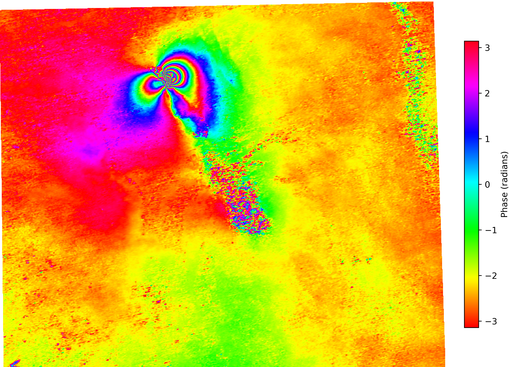

# 🚀 NISAR InSAR Processing Workflow (ISCE3)

<p align="center">
  <b>End-to-End Interferometric Processing using ISCE3</b><br>
</p>

---

## 📌 Overview

This repository provides a **complete workflow** for processing NISAR InSAR data using the **ISCE3 framework**.

It enables transformation of RSLC (Radar Single Look Complex) data into geocoded deformation products through a robust interferometric processing chain.

### 🔍 Key Capabilities
- 📡 Interferogram generation  
- 📉 Dense offset estimation  
- 🧩 Rubbersheet correction  
- 🌍 Geocoding  
- 📈 Surface deformation analysis  

---

## 🛰️ Dataset Used

```
NISAR_L1_PR_RSLC_005_172_A_008_2005_DHDH_A_20251122T024618_20251122T024652_X05007_N_F_J_001
```

---

## 🧰 Tech Stack

| Tool | Purpose |
|------|--------|
| 🐍 Python 3.9 | Core environment |
| 🛰️ ISCE3 | InSAR processing engine |
| 🗺️ GDAL | Raster & geospatial processing |
| 📦 HDF5 / h5py | Data format handling |
| 🧮 NumPy / SciPy | Scientific computation |
| 📊 Pandas | Data analysis |
| 🔓 SNAPHU | Phase unwrapping |
| 🌦️ PyAPS3 | Atmospheric correction |

---

## ⚙️ Installation & Execution

### 🟢 Step 1 — Create Conda Environment
```bash
conda create -n isce3 python=3.13
```
Create a new conda environment named `isce3`.

⚠️ Recommended: Use **Python 3.9** for stable ISCE3 workflows.

---

### 🟢 Step 2 — Activate Environment
```bash
conda activate isce3
```
Activate the environment to install all dependencies inside it.

---

### 🟢 Step 3 — Install ISCE3
```bash
conda install isce3 -c conda-forge
```
Installs the ISCE3 framework for NISAR InSAR processing.

---

### 🟢 Step 4 — Reinstall GDAL
```bash
conda install gdal -c conda-forge
```
Ensures compatibility between GDAL and ISCE3 dependencies.

---

### 🟢 Step 5 — Install Python Libraries
```bash
pip install pyaps3 pandas h5py pandas numpy scipy matplotlib hdf5 h5py netcdf4 gdal rasterio pyproj shapely snaphu
```
Installs required Python libraries for:
- Atmospheric correction (PyAPS3)  
- Numerical computation (NumPy, SciPy)  
- Data handling (Pandas)  
- Visualization (Matplotlib)  
- Geospatial processing (Rasterio, PyProj, Shapely)  
- HDF5 support (h5py, NetCDF4)  
- Phase unwrapping interface (SNAPHU)

---

### 🟢 Step 6 — Install GDAL HDF5 Support
```bash
conda install -c conda-forge libgdal-hdf5
```
Enables GDAL to read HDF5-based SAR data.

---

### 🟢 Step 7 — Reinstall GDAL (Link Fix)
```bash
conda install gdal -c conda-forge
```
Re-links GDAL with HDF5 dependencies.

---

### 🟢 Step 8 — Final GDAL Check
```bash
conda install gdal -c conda-forge
```
Final installation to resolve dependency conflicts.

---

### 🟢 Step 9 — Generate Run Configuration
```bash
python -m nisar.workflows.insar --generate-config > insar.yaml
```
Generates the default `insar.yaml` configuration file.

---

### 🟢 Step 10 — Run InSAR Workflow
```bash
python -m nisar.workflows.insar insar.yaml
```
Executes the full NISAR InSAR processing pipeline.

---

## ✅ Workflow Summary

```text
Environment Setup → Dependency Installation → Configuration → InSAR Processing
```

---

## ⚠️ Important Notes

- Use **Python 3.9** for stable results  
- Avoid mixing `pip` and `conda` installations for core libraries  
- Always generate a fresh `insar.yaml`  
- Start processing with **frequency A (freqA)**  
- Ensure DEM fully covers your study area  

---

---

## ⚠️ Important Notes

- Use **Python 3.9** for stable results  
- Avoid mixing `pip` and `conda` installations for core libraries  
- Always generate a fresh `insar.yaml`  
- Start processing with **frequency A (freqA)**  
- Ensure DEM fully covers your study area  

---

## 📝 Configuration (insar.yaml)

Before execution, update:

- 📂 Reference RSLC file  
- 📂 Secondary RSLC file  
- 🏔️ DEM file  
- 📤 Output directory  

### Example
```yaml
input_file_group:
  reference_rslc_file: /path/to/reference.h5
  secondary_rslc_file: /path/to/secondary.h5

dynamic_ancillary_file_group:
  dem_file: /path/to/dem.tif

product_path_group:
  product_path: ./output
```

---

## 🔄 Processing Pipeline

```
RSLC
 ↓
Coregistration
 ↓
Interferogram (RIFG)
 ↓
Dense Offset Estimation
 ↓
Rubbersheet Correction
 ↓
Phase Filtering
 ↓
Phase Unwrapping (SNAPHU)
 ↓
Geocoding
 ↓
RUNW → GUNW
```

---

## 📊 Output Products

- 🌈 Wrapped interferogram (RIFG)  
- 📐 Unwrapped phase (RUNW)  
- 📉 Coherence maps  
- 📍 Dense offset fields  
- 🌍 Geocoded deformation products (GUNW)  

---

## ⚠️ Important Notes

- ⚠️ ISCE3 is most stable with **Python 3.9**
- ❌ Avoid Python 3.13 for production runs  
- ❌ Avoid mixing pip & conda (except PyAPS3)  
- 🔄 Always regenerate `insar.yaml`  
- 🎯 Start with **freqA only**  
- 🗺️ Ensure DEM coverage is complete  

---

## 🧪 Common Issues & Fixes

### YAML Validation Error
```bash
python -m nisar.workflows.insar --generate-config > insar.yaml
```

### SNAPHU Error
```bash
conda install -c conda-forge snaphu
```

### Rubbersheet Error
→ Use only freqA

### Missing Modules
```bash
conda install pandas numpy scipy
```

## 🌈 Interferogram Output

<p align="center">
  
</p>
---

## 🌍 Applications

- 🌎 Earthquake deformation analysis  
- 🌋 Volcano monitoring  
- 🧊 Glacier motion tracking  
- 🏗️ Infrastructure monitoring  
- 🌱 Land subsidence studies  

---

## 👨‍💻 Author

**Harsha Vardhan Gosangi**  
Research Scholar – Remote Sensing & Geoinformatics  

---

## ⭐ Support

If this project helped you, consider giving it a ⭐ on GitHub!

---

## 📜 License

This project is intended for research and educational purposes only.
